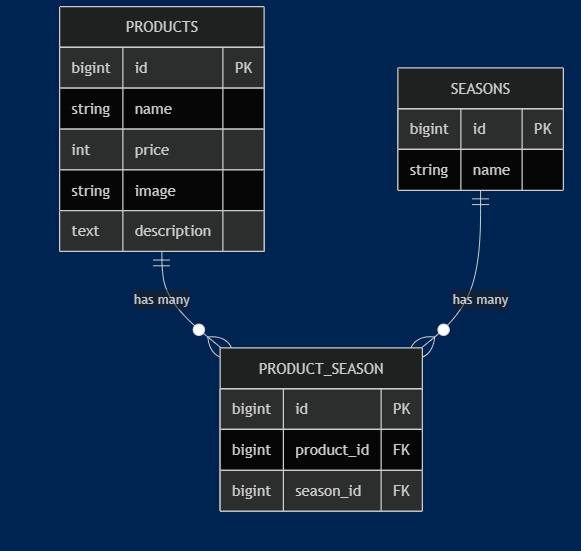

# coachtech もぎたて

## 環境構築

本アプリは Docker を使用して開発しています。
以下の手順で環境を構築できます。

1. リポジトリを clone
2. Docker を起動
3. phpMyAdmin が利用可能（http://localhost:8080）
4. `php artisan migrate` を実行しテーブルを作成

## 使用技術（実行環境）

- Laravel 10.x
- PHP 8.x
- MySQL
- Docker
- phpMyAdmin
- HTML / CSS

## ER図

## URL

- 開発環境: http://localhost/
- phpMyAdmin: http://localhost:8080/
